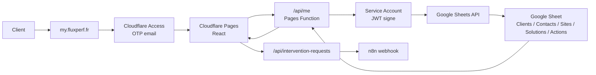

# Architecture My FluxPerf

Document d'archive pour comprendre rapidement le fonctionnement de `my.fluxperf.fr`.

## L'idee en une phrase

`my.fluxperf.fr` est un portail client prive : Cloudflare verifie l'identite, l'application lit uniquement la fiche du client connecte dans Google Sheets, puis React affiche son dashboard.

## Les roles, version ludique

Imagine le portail comme une agence FluxPerf avec plusieurs personnes a l'accueil.

| Outil | Role dans l'histoire | Role technique |
| --- | --- | --- |
| Domaine `my.fluxperf.fr` | L'adresse sur la porte | Adresse publique utilisee par les clients |
| Cloudflare DNS | Le panneau qui indique ou aller | Fait pointer `my.fluxperf.fr` vers Cloudflare Pages |
| Cloudflare Pages | Le batiment qui sert le portail | Heberge le frontend React et les Pages Functions |
| Cloudflare Access | Le vigile souriant a l'entree | Demande un code email OTP et autorise uniquement les emails prevus |
| Cookie/JWT Access | Le bracelet visiteur | Prouve a l'API que l'utilisateur est deja authentifie |
| React/Vite | La salle d'accueil client | Affiche le dashboard, les cartes, les services et les ressources |
| `/api/me` | Le guichet prive | Recupere l'email connecte et retourne une seule fiche client |
| Pages Functions | Le bureau cote serveur | Execute le code API sur Cloudflare, sans exposer les secrets au navigateur |
| Google Sheet | Le classeur clients | Contient les donnees clients, contacts, sites et solutions |
| Google Service Account | Le badge lecteur | Autorise l'API a lire le Google Sheet sans compte humain |
| Google Sheets API | Le bibliothecaire | Donne les lignes demandees au serveur apres verification du badge |
| GitHub | L'atelier source | Stocke le code et declenche les builds Cloudflare |
| Formulaire natif | Le comptoir demandes | Collecte les demandes d'intervention depuis MyFluxperf |
| n8n | Le repartiteur | Recoit les demandes, cree les taches, declenche Brevo et journalise |
| Jotform | Le comptoir support historique | Peut encore ouvrir un formulaire support quand l'URL est renseignee |
| Looker Studio | Salle historique d'indicateurs | Peut rester reference via `report_url`, mais le dashboard V1 affiche le module Impacts |

## Chemin d'une connexion

1. Le client ouvre `https://my.fluxperf.fr`.
2. Cloudflare Access intercepte la demande avant l'application.
3. Le client saisit son email et recoit un code temporaire.
4. Si l'email est autorise par la strategie Access, Cloudflare ouvre la porte.
5. Le navigateur charge le dashboard React.
6. React appelle `/api/me`.
7. La Pages Function lit l'identite Cloudflare Access : header email ou jeton Access.
8. La Pages Function lit le Google Sheet via le Service Account.
9. L'API cherche le client actif correspondant a l'email connecte.
10. L'API renvoie uniquement la fiche de ce client.
11. React affiche le dashboard.

## Schema visuel

Voir le fichier [schema-my-fluxperf.svg](schema-my-fluxperf.svg).



## Donnees Google Sheet utilisees

Le portail supporte la structure actuelle de la BDD :

| Onglet | Usage |
| --- | --- |
| `Clients` | Identite du compte, statut client, activation de l'espace client, email principal |
| `Contacts` | Prenom, nom, email, statut contact |
| `Sites` | Sites rattaches au client, domaine, URL, statut, suivi actif |
| `Solutions` | Services Fluxperf actifs rattaches au client pour les services affiches et le temps libere |
| `Actions` | Journal des demandes client affiche dans le module Dernieres actions |
| `Parametres` | Valeurs de reference pour la BDD, non lues par le portail MVP |

Conditions pour qu'un client soit affiche :

- `Clients.statut_client = Actif`
- `Clients.espace_client_actif = Oui`
- l'email connecte correspond a `Clients.email_principal` ou a un contact actif de l'onglet `Contacts`

## Variables Cloudflare Pages

Variables principales :

```env
APP_ENV=production
GOOGLE_SHEET_ID=1UQg2AbJYg2GEfzHshUVaAVfDvIdHHQHAw7LADcAUvKA
GOOGLE_SHEET_RANGE=Clients!A1:Z1000
GOOGLE_CONTACTS_RANGE=Contacts!A1:Z1000
GOOGLE_SITES_RANGE=Sites!A1:Z1000
GOOGLE_SOLUTIONS_RANGE=Solutions!A1:Z1000
GOOGLE_ACTIONS_RANGE=Actions!A1:J1000
GOOGLE_SERVICE_ACCOUNT_EMAIL=my-fluxperf-reader@fluxperf.iam.gserviceaccount.com
GOOGLE_PRIVATE_KEY=...
CF_ACCESS_HOSTNAME=my.fluxperf.fr
N8N_INTERVENTION_WEBHOOK_URL=...
N8N_INTERVENTION_WEBHOOK_SECRET=...
```

`GOOGLE_PRIVATE_KEY` doit rester en secret Cloudflare. Elle ne doit jamais etre mise dans GitHub.

## Securite

Ce qui protege les donnees :

- Cloudflare Access bloque les visiteurs non autorises avant le portail.
- `/api/me` ignore les emails simules en production.
- L'API ne renvoie qu'un seul client : celui associe a l'email connecte.
- `/api/intervention-requests` reverifie l'identite et refuse les sites non rattaches au client.
- La cle Google reste cote Cloudflare Pages Functions.
- Le navigateur ne voit jamais la feuille complete ni la cle privee.
- L'URL `pages.dev` ne doit pas servir de portail client principal.

## Lecture des erreurs

| Message | Signification | Action |
| --- | --- | --- |
| `AUTH_REQUIRED` | L'API ne recoit pas l'identite Cloudflare Access | Verifier Access, le domaine protege, le deploiement du correctif JWT |
| `CLIENT_NOT_CONFIGURED` | L'utilisateur est connecte mais aucun client actif ne correspond | Verifier `email_principal`, `Contacts.email`, `statut_client`, `espace_client_actif` |
| `DATA_UNAVAILABLE` | L'API n'arrive pas a lire Google Sheets | Verifier variables Cloudflare, cle privee, partage du Sheet au Service Account, onglets/ranges |
| `WEBHOOK_FAILED` | n8n n'a pas accepte une demande | Verifier le workflow n8n, l'URL webhook et le secret partage |

## Checklist de reprise pour un developpeur

1. Lire `README.md`.
2. Lire ce fichier.
3. Verifier les variables Cloudflare Pages.
4. Verifier la strategie Cloudflare Access sur `my.fluxperf.fr`.
5. Verifier que le Google Sheet est partage en lecture avec le Service Account.
6. Lancer en local :

```bash
pnpm install
pnpm run typecheck
pnpm run test
pnpm run build
```

7. Pousser sur `main` pour declencher un deploiement Cloudflare Pages.

## Recette apres chaque changement

1. `https://my.fluxperf.fr/api/health` retourne `status: ok`.
2. En navigation privee, Cloudflare Access demande un email et envoie un OTP.
3. Un email autorise arrive sur le dashboard.
4. Un email absent ou client inactif affiche un refus propre.
5. La demande d'intervention s'envoie avec et sans piece jointe.
6. Les sites proposes correspondent uniquement au client connecte.
7. Le module Impacts affiche le temps libere ou un etat vide si aucune donnee n'est active.
8. Desktop et mobile restent lisibles.
